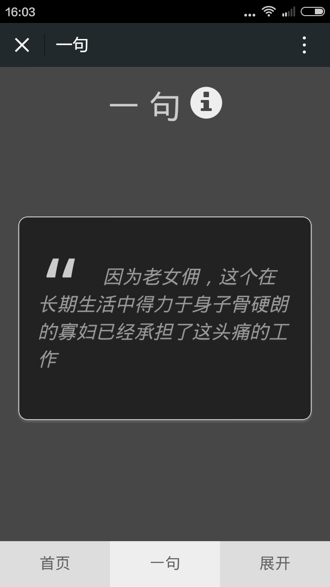
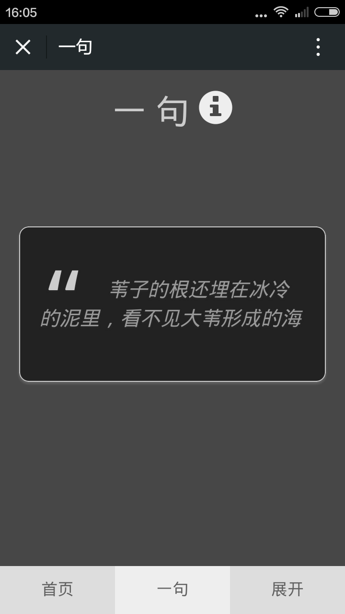
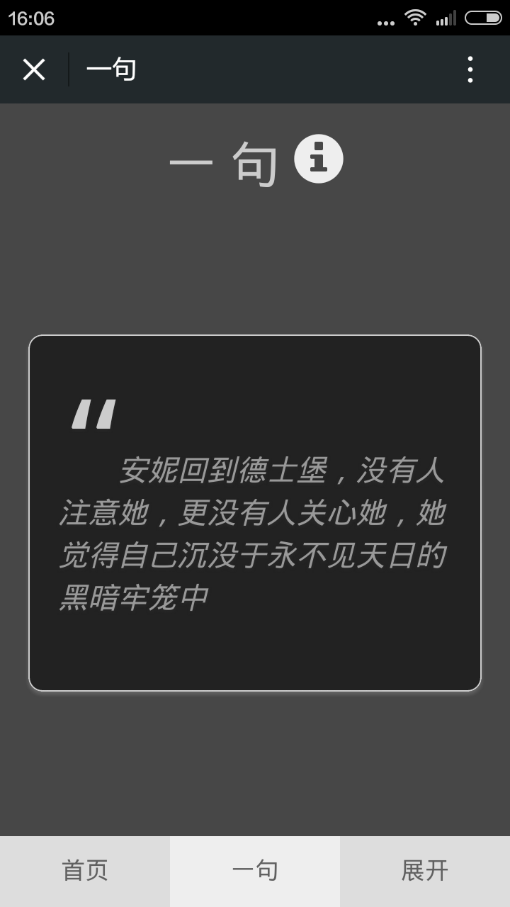
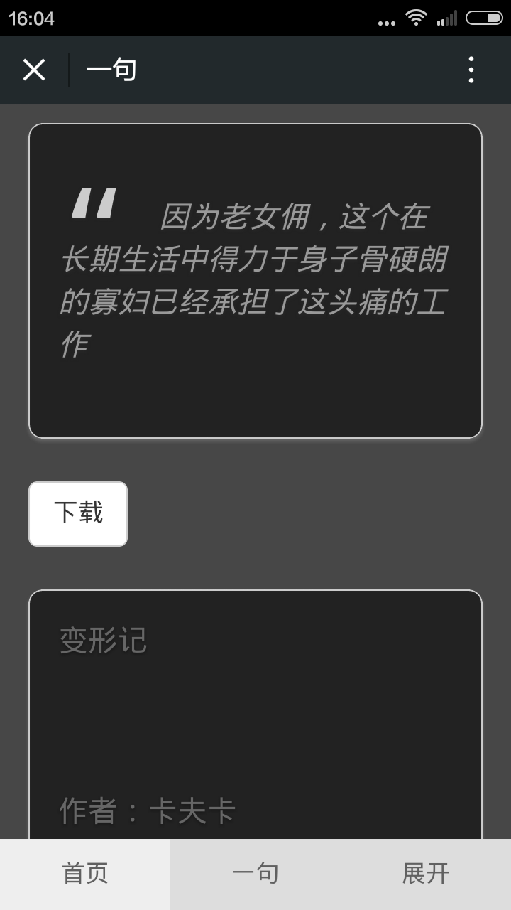

# 一句

### 演示
http://one.treenote.net/  
手机扫码打开  

### 这是什么?
"一句"是一个超轻的阅读应用,从大量文字中随手翻出一句.

看到喜欢的句子,可以就地展开,或者从头阅读

### 灵感
来源于我的另一应用: [唐诗密码本](http://mima.treenote.net)

### 开源项目
这是一个开源项目, https://github.com/fangj/one, 用 express,angular 搭建. 欢迎小伙伴到 github 上点小星星.

### 关于我
饭叔,湖建血统的南京土著. 养着一只肥白的中华田园猫. 有很多有趣的想法,就是没空做T T.
